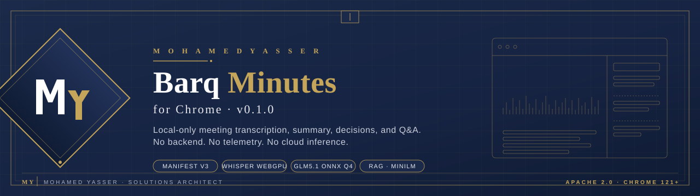

<p align="center">
  
</p>

<h1 align="center">Barq Minutes for Chrome</h1>

<p align="center">
  <strong>Private. Local. On-device.</strong><br/>
  A Chrome side-panel app that records or ingests meeting audio, transcribes it with Whisper on WebGPU, and extracts decisions, action items, open questions, summary, and meeting Q&amp;A
  <br/>
  <em>without a backend, without telemetry, without any cloud inference.</em>
</p>

<p align="center">
  <a href="LICENSE"></a>
  
  
  
  
  
</p>

---

## Table of contents

- [What it does](#what-it-does)
- [Architecture](#architecture)
- [Install (developer mode)](#install-developer-mode)
- [How it works](#how-it-works)
- [Models](#models)
- [Permissions](#permissions)
- [Privacy](#privacy)
- [Development](#development)
- [Project layout](#project-layout)
- [Roadmap](#roadmap)
- [License](#license)
- [Author](#author)

---

## What it does

| Capability | Detail |
| --- | --- |
| **Record** | Microphone recording inside the side panel with live waveform and live transcript |
| **Upload** | mp3, m4a, wav, ogg, webm, flac decoded to PCM in the browser |
| **Transcribe** | Whisper Base ONNX, WebGPU when available, WASM fallback |
| **Extract** | Decisions, action items, and open questions per chunked window |
| **Dedupe** | MiniLM L6 v2 embedding clusters at cosine 0.85 |
| **Summarize** | Two-pass executive summary (3 to 6 bullets) |
| **Ask** | Local RAG: top 5 transcript chunks &rarr; constrained answer with sources |
| **Export** | Markdown and PDF; timestamps appear in the transcript only |
| **Persist** | IndexedDB only; audio storage is opt-in and disabled by default |

---

## Architecture

```
+-----------------------------------------------------------+
|                       Chrome browser                      |
|                                                           |
|  +--------------------+      +-----------------------+    |
|  |  Side panel (UI)   |<---->|  Background worker    |    |
|  |  React 19 + TS     |      |  (Manifest V3)        |    |
|  +---------+----------+      +-----------------------+    |
|            |                                              |
|            v                                              |
|  +--------------------+    +-----------------------+      |
|  |  Pipeline runtime  |--->|  Local model sessions |      |
|  |  Recording, ASR    |    |  - Whisper (WebGPU)   |      |
|  |  Extraction loop   |    |  - GLM5.1 distill Q4  |      |
|  |  Dedupe + summary  |    |  - MiniLM embeddings  |      |
|  |  RAG retrieval     |    +-----------+-----------+      |
|  +---------+----------+                |                  |
|            |                            v                 |
|            v                  +---------------------+     |
|  +--------------------+       |  Browser model      |     |
|  |   IndexedDB        |       |  cache (HF assets)  |     |
|  |   meetings         |       +---------------------+     |
|  |   audio (opt-in)   |                                   |
|  |   vectors (RAG)    |                                   |
|  |   settings         |                                   |
|  +--------------------+                                   |
+-----------------------------------------------------------+

External network: only Hugging Face on first model download.
After that, all processing is local.
```

**Key design decisions**

- The MV3 service worker stays lightweight and is **never** used for inference. ASR, LLM, and embedding work runs in the side-panel page (and the offscreen document if needed) so WebGPU and WASM sessions are not torn down by worker suspension.
- The transcript is **never** passed to the LLM in one call. It is split into ~6,000 character windows with 600 character overlap, with sentence/turn-aware boundary search.
- Dedupe is **deterministic**: normalize, embed, cluster at cosine ≥ 0.85, keep the longest variant, and merge metadata. The LLM is not used for dedupe.
- Q&A is **strictly grounded**: only the top 5 retrieved chunks reach the model, and the same chunks are surfaced in the UI so users can verify each answer.

---

## Install (developer mode)

> Requires Node 20+ and Chrome 121+.

```bash
git clone https://github.com/YASSERRMD/barq-minutes-chrome.git
cd barq-minutes-chrome
npm install
npm run build
```

Then load the `dist/` folder as an unpacked extension:

1. Open `chrome://extensions`
2. Enable **Developer mode** (top right)
3. Click **Load unpacked**
4. Select the generated `dist/` folder

Click the Barq Minutes toolbar icon to open the side panel.

---

## How it works

### 1. Capture

| Source | Path |
| --- | --- |
| Microphone | `MediaRecorder` → 1 s chunks → live transcriber |
| File upload | `decodeAudioData` → mono 16 kHz PCM → 30 s windows |

### 2. Transcribe

A sliding window (~8 s) is fed to Whisper while recording, so the user sees text within a few seconds. On stop, only the **remaining unprocessed audio** is finalised, never the entire blob.

### 3. Extract (long-context safe)

For each transcript window, three independent JSON calls run with `max_new_tokens=256`, `temperature=0.1`, strict JSON output, zod validation, and one stricter retry on malformed output.

```text
window  →  extract_decisions
        →  extract_actions
        →  extract_questions
```

### 4. Deduplicate

```text
items  →  normalize (lower, stopwords, naive stem)
       →  MiniLM embeddings
       →  cosine cluster ≥ 0.85
       →  longest variant wins, merge metadata
```

### 5. Summarize

Per-window short summary, then a final 3 to 6 bullet executive summary built from the chunk summaries. **No timestamps, no extracted-count bullets, no transcript excerpts** in the summary.

### 6. Index for Q&A

Transcript is rechunked at ~512 tokens with 64-token overlap, embedded with MiniLM, and stored in the local vector index. Top-5 cosine retrieval feeds answers.

### 7. Ask

```text
question  →  embed
          →  top 5 chunks
          →  LLM constrained to retrieved context
          →  answer + clickable source chunks with timestamps
```

---

## Models

| Role | Model | Quant | Approx. size | Loaded |
| --- | --- | --- | --- | --- |
| ASR | `Xenova/whisper-base` | Q8 ONNX | ~150 MB | On first record / upload |
| LLM | `yasserrmd/glm5.1-distill-onnx` | Q4 ONNX | ~600 MB | On first extraction |
| Embeddings | `Xenova/all-MiniLM-L6-v2` | Q8 ONNX | ~25 MB | On first dedupe / RAG |

Models are cached by the browser after first download. Each is loaded as a **singleton** per tab so WebGPU and WASM sessions are not duplicated.

---

## Permissions

| Permission | Why it is requested |
| --- | --- |
| `sidePanel` | The main UI is the side panel |
| `storage` | Settings persistence |
| `offscreen` | Reserved for offscreen audio work |
| `tabCapture` *(optional)* | Future tab audio capture |
| `activeTab` *(optional)* | Optional context for the current tab |
| `huggingface.co` *(host)* | First-time model download only |

The extension does **not** request broad host permissions.

---

## Privacy

- All meeting data lives in **IndexedDB** in your browser only.
- **Audio storage is opt-in** and disabled by default.
- **No analytics. No telemetry. No background data collection.**
- **No external inference.** No OpenAI, Anthropic, Google, or any other API is called.
- The only outbound traffic is the first model download from Hugging Face.

Full statement in [PRIVACY.md](./PRIVACY.md).

A one-click **Clear all meeting data** button lives in the in-app Settings page.

---

## Development

```bash
npm run dev        # Vite dev server (UI only)
npm run build      # production extension to ./dist
npm run typecheck  # tsc --noEmit
```

**Stack:** Vite 6, React 19, TypeScript 5, `@huggingface/transformers`, `onnxruntime-web`, `idb-keyval`, `zod`, `barq-vweb`, `barq-wasm`, `html-to-image`, `jspdf`.

**House rules in this repo**

- Phased branches: `phase-NN-*` &rarr; PR &rarr; merge to `main` &rarr; delete branch.
- Atomic conventional commits.
- No em dashes anywhere in code, comments, docs, or UI text.
- No telemetry, no analytics, no remote inference can ever be added.

---

## Project layout

```
barq-minutes-chrome/
├── manifest.json               Manifest V3
├── vite.config.ts              Multi-entry extension build
├── src/
│   ├── background/             MV3 service worker
│   ├── sidepanel/              Main UI (routes + components)
│   ├── popup/                  Quick launcher
│   ├── options/                Options page
│   ├── offscreen/              Offscreen document
│   └── shared/
│       ├── models/             Whisper, GLM5.1, MiniLM loaders + cache
│       ├── pipeline/           Recorder, ASR, extraction, dedupe, summary, RAG
│       ├── storage/            IndexedDB stores + clear workflows
│       ├── schemas/            zod schemas
│       ├── utils/              ULID, time, text helpers
│       └── styles/             Theme tokens
├── assets/                     Branding (banner)
├── PRIVACY.md
├── CHANGELOG.md
└── LICENSE                     Apache 2.0
```

---

## Roadmap

- Tab-audio capture for browser-based meetings
- Speaker diarization on top of Whisper segments
- Multi-meeting search across the local index
- Encrypted-at-rest IndexedDB option

---

## License

[Apache License 2.0](./LICENSE) © 2026 Mohamed Yasser.

---

<p align="center">
  <sub><b>MY</b> &nbsp;|&nbsp; Mohamed Yasser &nbsp;·&nbsp; Solutions Architect</sub>
</p>
